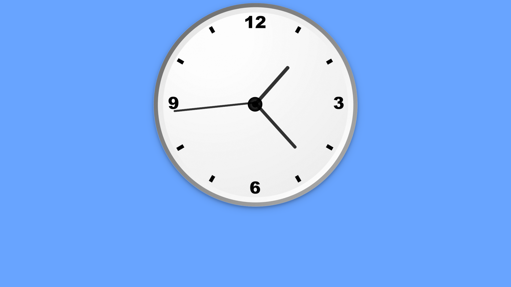

# JavaScript-Analog-Clock
Analog Clock Made with HTML5, CSS3 and JavaScript

## Screenshots

## Tech Stack

HTML5, CSS3, JavaScript

## Authors

- [@rtewari056](https://www.github.com/rtewari056)

## 🔗 Links

